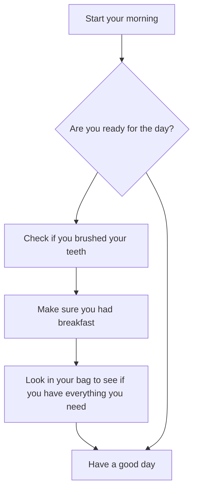

# Flowchart #

```mermaid
 flowchart TD;
     A[Start your morning]-->B{Are you ready for the day?};
     B --> C[Check if you brushed your teeth]
     C --> D[Make sure you had breakfast]
     D --> E[Look in your bag to see if you have everything you need]
     E --> F
     B --> F[Have a good day]


```

* A * Program loads

* B * Check to see if it's working