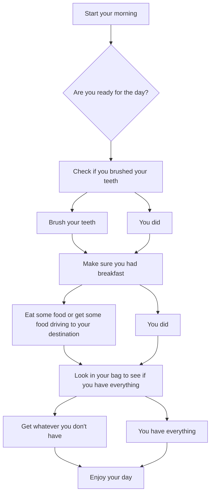

# Getting Started in the morning #
_A flowchart to make sure you are ready for the morning._

* A - Starting point

* B - Entry into questions

* C - Question 1

* D - Answering no to question 1

* E - Answering yes to question 1

* F - Second Question, Both D and E connect to this

* G - Answering no to question 2

* H - Answering yes to question 2

* I - Question 3, G and H connect to I

* J - Answering no to question 3

* K - Answering yes to question 3

* L - End point, both J and K connect to this point

 