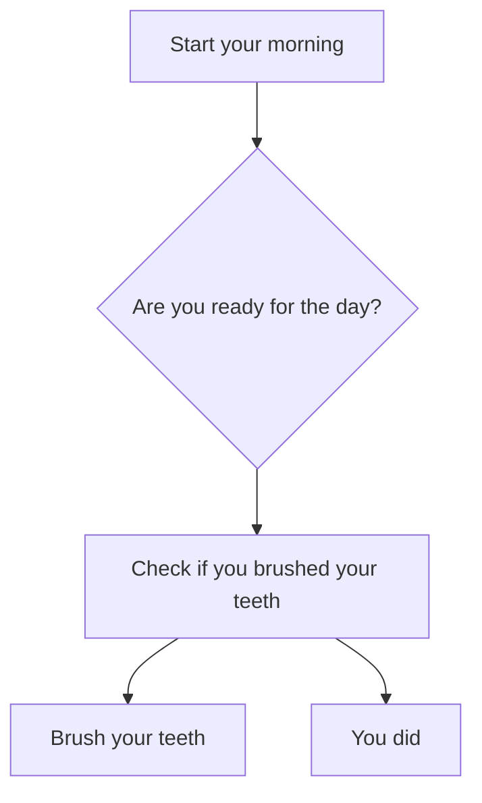

# Getting Started in the morning #

```mermaid
 flowchart TD;
     A[Start your morning]-->B{Are you ready for the day?};
     B --> C[Check if you brushed your teeth]
     C --> D[Brush your teeth]
     C --> E[You did]
     
    
    

```

* A * Program loads

* B * Check to see if it's working

 