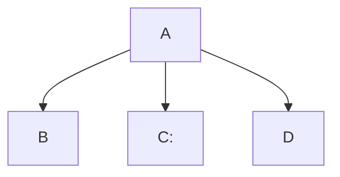

# Edward3785.github.io

Name: Edward Michael
Email: emichael1@my.waketech.edu

This is my school account for GitHub as I have never made an account before on GitHub.

The repository I have created will be there to keep the assignments I receive in this class and any other extra requirements this class may have.

MrsP

# About Me #
_My name is Edward Michael. I'm currently 18 soon to be 19 and I graduated from Athens Drive._

## My Interests ##
_I mainly enjoy running outside if it wasn't freezing everyday. I also enjoy playing card games such as blackjack. I want to work with computers because of the large variety of job options that are available because of it._

## Websites I Recommend ##
A website I recommend is [Wikipedia](https://www.wikipedia.org/) - While it may not all be reliable information its useful in getting a grasp on the topic you want to research.

Another website I use often is [Youtube](https://www.youtube.com/) - It's useful for finding information and also good for some entertainment. A good way to waste a day. 

# Mermaid Test #

